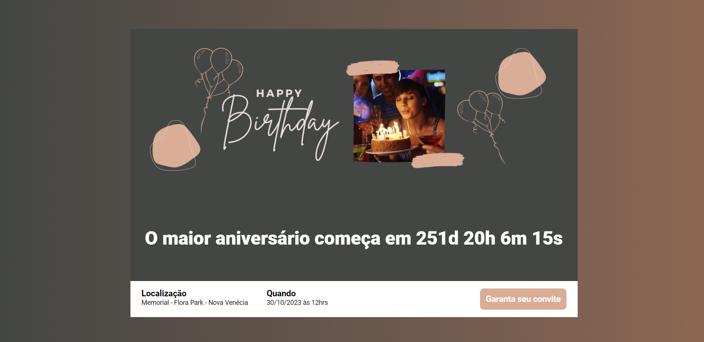

# Página de um evento
Esse projeto consiste na criação de uma landing page para um evento, o tema é o meu aniversário
Esta aplicação está disponível online no endereço: [Jhuly´s niver](https://agenda-contatos-ruby.vercel.app/).

## Tecnologias utilizadas
- HTML5
- CSS3
- JavaScript
- SASS
- Parcel

## Como rodar o projeto
- Baixar ou clonar este repositório, no terminal executar `npm i` ou `npm install`
- Para executar o parcel, usar o comando `npm run dev`

